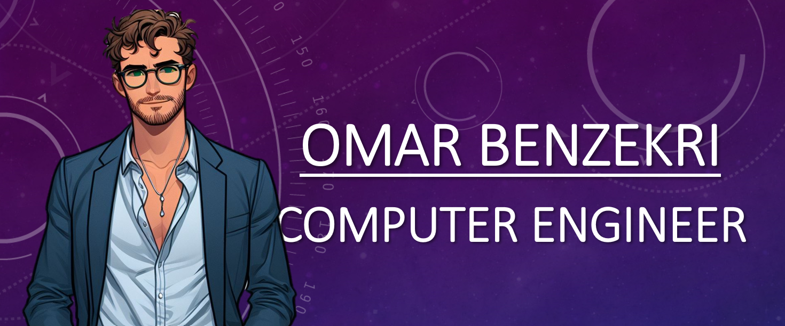

<h1 style="text-align: center">Hi, I'm Omar Benzekri :wave:</h1>

<h2 style="text-align: left">:male_detective: About</h2>
<ul>
  <li>
    

      I more commonly known as the <b>CSS King</b> :crown:, and I have many projects under my belt. :computer:
    

  </li>
  <li>
    

      I study at <a href="https://www.polymtl.ca/">Polytechnique Montréal</a> in computer engineering. :school:
    

  </li>
  <li>
    

      For business inquiries, please message me directly on <a href="https://www.linkedin.com/in/omar-benzekri1/">LinkedIn</a>. :sparkler:
    

  </li>
  <li>
    

      I also started working on GitLab! <a href="https://gitlab.com/o-benz">Check me out!</a> :rocket:
    

  </li>
</ul>

<h2 style="text-align: left">:globe_with_meridians: Deployed Websites</h2>
<ul>
  <li>
    

      <a href="http://polytechnique-montr-al.gitlab.io/log2990/20241/equipe-101/LOG2990-101/#/home">Web Application : SmartyShowdown</a>
    

  </li>
  <li>
    

      <a href="https://rustaheat.co/#/home">Morgan Stanley's CTG Hackathon 2024: StepByStep</a>
    

  </li>
</ul>

<h2 style="text-align: left">:zap: Stats</h2>

