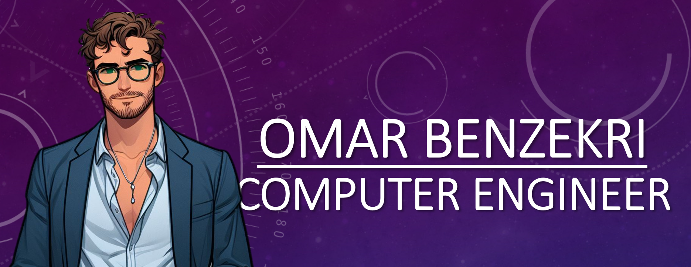

<!--<h1 style="text-align: center">Hi, I'm Omar Benzekri :wave:</h1>

-->

<b>:male_detective: About</b>
<ul>
  <li>
    

      I am fluent in <i>English</i>, <i>French</i>, <i>Spanish</i>, and <i>Arabic</i>.
    

  </li>
  <li>
    

      I work at <a href="https://www.shopify.com/">Shopify</a> as a <b>Software Engineer</b>.
    

  </li>
  <li>
    

      I study at <a href="https://www.polymtl.ca/">Polytechnique Montréal</a> in <b>Computer Engineering</b> with a minor in <b>AI and Data Science</b>.
    

  </li>
</ul>

  
<b>💼 Experience</b>

  <ul>
    <li>
      

         I have been working as a <b>Software Engineer</b> at <a href="https://www.shopify.com/">Shopify</a> since May 2025. 🛍️
      

    </li>
    <li>
      

         I worked as a <b>Software Developer</b> at <a href="https://www.cae.com/">CAE</a> between January and April 2025. ✈️ 
      

    </li>
    <li>
      

         I worked as a <b>Data Engineering Analyst</b> at <a href="https://www.nbc.ca/">National Bank of Canada</a> between May 2024 and April 2025. 🏦
      

    </li>
    <li>
      

         I worked as a <b>Business Intelligence Engineer</b> at <a href="https://www.admtl.com/">ADM Montreal Airports</a> between May and September 2023. 🛬
      

    </li>
    <li>
      

         I worked as a <b>Teacher Assistant</b> at <a href="https://www.polymtl.ca/">Polytechnique Montréal</a> between January and December 2023. 🏫
      

    </li>
    <li>
      

        I worked as a <b>Coding Instructor</b> at <a href="https://www.cimf.ca/">Collège international Marie de France</a> between September 2020 and December 2024. 👨‍🏫
      

    </li>
  </ul>

  
<b>:globe_with_meridians: Deployed Websites</b>

  <ul>
    <li>
      

        <a href="https://polyloop.ca/">PolyLoop</a>
      

    </li>
    <li>
      

        <a href="https://o-benz.github.io/home">My Personal Web Portfolio</a>
      

    </li>
    <li>
      

        <a href="https://drissandnawal.github.io/">My Brother's Wedding Website</a>
      

    </li>
    <li>
      

        <a href="https://beyondgpa.github.io/">Data Visualization Project : BeyondGPA</a>
      

    </li>
    <li>
      

        <a href="http://polytechnique-montr-al.gitlab.io/log2990/20241/equipe-101/LOG2990-101/#/home">Web Game : SmartyShowdown</a>
      

    </li>
    <li>
      

        <a href="https://rustaheat.co/#/home">Morgan Stanley's CTG Hackathon : StepByStep</a>
      

    </li>
  </ul>

  
<b>📚 Coursework Catalog</b>

  <!--
  

    <a href="https://github.com/o-benz/OverEngineered">OverEngineered : A PolyMTL Ressource Hub</a>
  

  -->
  <ul>
    <li>
      

        <a href="https://github.com/o-benz/CSI2510">CSI2510 : Data Structures and Algorithm</a>
      

    </li>
    <li>
      

        <a href="https://github.com/o-benz/INF1015">INF1015 : Advanced Object Oriented Programming</a>
      

    </li>
    <li>
      

        <a href="https://github.com/o-benz/INF2610">INF2610 : Operating Systems</a>
      

    </li>
    <li>
      

        <a href="https://github.com/o-benz/INF2705">INF2705 : Computer Graphics</a>
      

    </li>
    <li>
      

        <a href="https://github.com/o-benz/INF3405">INF3405 : Computer Networks</a>
      

    </li>
    <li>
      

        <a href="https://github.com/o-benz/INF3500">INF3500 : Complex Digital Systems</a>
      

    </li>
    <li>
      

        <a href="https://github.com/o-benz/INF3610">INF3610 : Embedded Systems</a>
      

    </li>
    <li>
      

        <a href="https://github.com/o-benz/INF8008">INF8008 : Data Preprocessing</a>
      

    </li>
    <li>
      

        <a href="https://github.com/o-benz/INF8225">INF8225 : Artificial Intelligence: Probabilistic and Learning Techniques</a>
      

    </li>
    <li>
      

        <a href="https://github.com/o-benz/INF8808">INF8808 : Data Vizualisation</a>
      

    </li>
    <li>
      

        <a href="https://github.com/o-benz/ITI1520">ITI1520 : Introduction to Computing</a>
      

    </li>
    <li>
      

        <a href="https://github.com/o-benz/ITI1521">ITI1521 : Object Oriented Programming</a>
      

    </li>
    <li>
      

        <a href="https://github.com/o-benz/LOG2440">LOG2440 : Web Development</a>
      

    </li>
    <li>
      

        <a href="https://github.com/o-benz/MTH2302D">MTH2302D : Probabilities and Statistics</a>
      

    </li>
    <li>
      

        <a href="https://github.com/o-benz/SEG2505">SEG2505 : Fundamentals of Software</a>
      

    </li>
  </ul>

  
<b>:zap: Language Stats</b>

   
  

<!--    
  <b>Visitor Count :</b>
    -->
  

